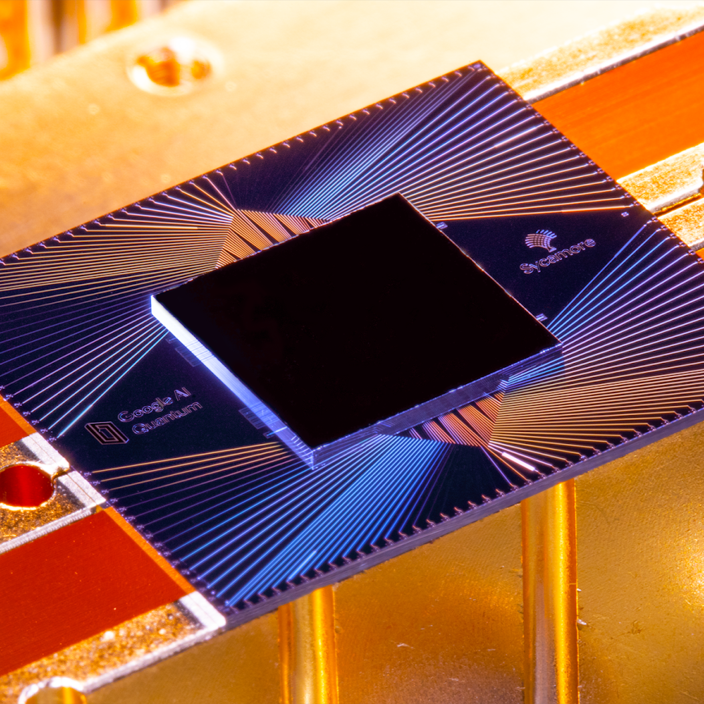
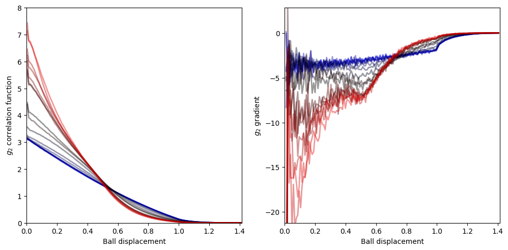
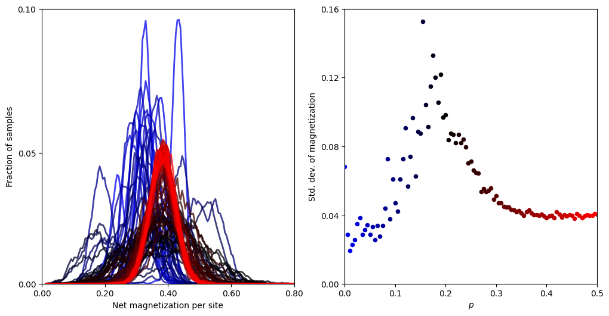
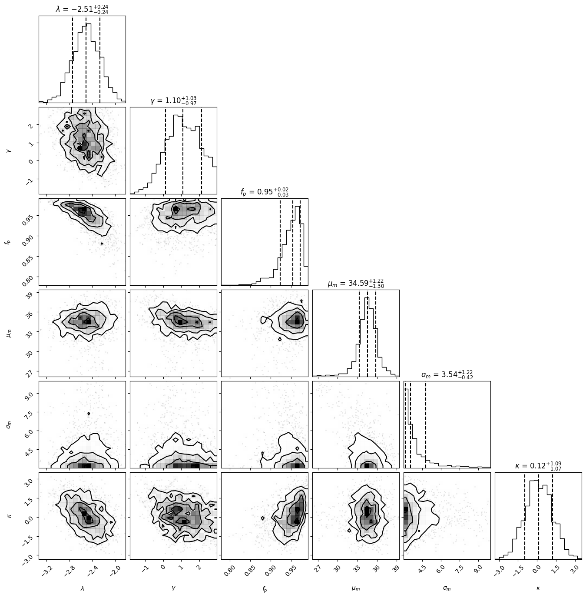

# Sampling spheres and spins

[Notebooks, documentation for the sampler package can be found in the docs site for this repo](https://potatoasad.github.io/Computational-Physics-Final-Project/)

### Final Project, Computational Physics, Fall 2023

_Aditi Pujar, Asad Hussain, Kody Anderson, Shivan Mittal_

<p>
	
	
	
</p>
Imagine a distribution $\rho(\mathbf{x})$ over the domain $\mathbf{x} \in X \subset \mathbb{R}^n.$ Sampling algorithms are answers to the question: Given that we do not have exact knowledge of the functional form of $\rho,$ can we nonetheless generate samples from $\rho?$ In particular, _Markov Chain Monte Carlo_ algorithm is a sampling algorithm that only requires the knowledge of relative likelihood of two samples $\mathbf{x}_1$ and $\mathbf{x}_2$ drawn from the distribution $\rho,$ i.e. knowledge of ${\rm Likelihood} = \rho(\mathbf{x}_1) / \rho(\mathbf{x}_2)).$ _Hamiltonian Monte Carlo_ algorithm is another such sampling algorithm that further requires the knowledge of (a priori or empirically by differentiable ``code'') the gradient of the likelihood.
Numerous Physical problems can benefit from sampling algorithms. These range from (Classical and Quantum) many-body problems to data analysis for large scale Physics experiments (LIGO, CERN).

1. to package our own _Markov Chain Monte Carlo_ algorithm and existing _Hamiltonian Monte Carlo_ algorithm from `blackjax` library into a single class interface, and
2. to demonstrate the ease of use of out interface and the utility of the sampling algorithms via the following examples of,
   1. [Phase transition in classical soft-sphere packing problem](softspheres_blackjax_phase_transition.ipynb)
      1. Applications to classical error correcting codes
   2. [Phase transition in 1D quantum spin Hamiltonians](gossetbravyi_spin_chain_blackjax_phase_transition.ipynb)
   3. [Black hole parameter estimation using real observatory data from LIGO](BlackHolePopulationAnalysis.ipynb)

### Plots from our work
<p>
	<figure>
		
		<figcaption> Phase transition in soft sphere packing correlation function with lowering temperature </figcaption> 
	</figure>
	<br><br><br><br>
	<figure>
		
		<figcaption> Phase transition in 1D Quantum spin chain with increasing parameter "p" of the Hamiltonian (characterizes the Bell-state property of a local term in the Hamiltonian)  </figcaption> 
	</figure>
  <figure>
		
		<figcaption> Posterior distribution for the hyperparameters of a population model computed by performing hierarchical inference on samples from every confident LIGO binary black hole detection</figcaption> 
	</figure>
</p>


<!---
### Ideas
Project ideas
- [x] Sampling + gradient descent + packing problems + glass phase transition
- [x] Statistical Mechanics steady state problems
- [x] Bayesian Inference
  
- [ ]  Inspiral stochastic dynamics
- [ ] Differentiable ODE solver 
- [ ] Finding distribution samples are coming from
- [ ] Differentiable ODE solver with distribution of parameter estimation
- [ ] Stochastic stuff is common interest 
- [ ] Different cost functions corresponding to different measures of distance between distributions
- [ ] KPZ
- [ ] Imaginary time evolution and LQFT

### What's common in the things we've selected:

- [ ] A class to sample using any/many methods (or use pre packaged samplers):
  - [x] Inverting CDF
  - [x] Metropolis Hastings
    - [ ] Benchmark for a nice potential landscape:
      - [ ] e.g. $C(x) = \frac{1}{2}x^2$
  - [ ] Maybe Gradient based? Hamiltonian Monte Carlo?
  
- [ ] A class to define a probability distribution over the state space,
  - [ ] break up into Cost function $C(x)$ and prob distribution over the state space $\exp(-\beta C(x))$

- [ ] Classes that inherit from the above but is specific to the applications
      
```python
#import jax.numpy as jnp

try:
  import jax.numpy as np
else:
  import numpy as np
  

class Distribution:
  - pdf
	- logpdf return -0.5*x**2

class Sampler:
  - sample
  - distribution (object)

class MCMCSampler:
  - proposal step (acceptance criteria)
  - compute pdf ratio
  
class SamplerVisualization:
  - Sampler
  - Plots
  
class CornerPlot:
  

class StateSpaceAnimation
 - samples
 - animate() 
```
--->
